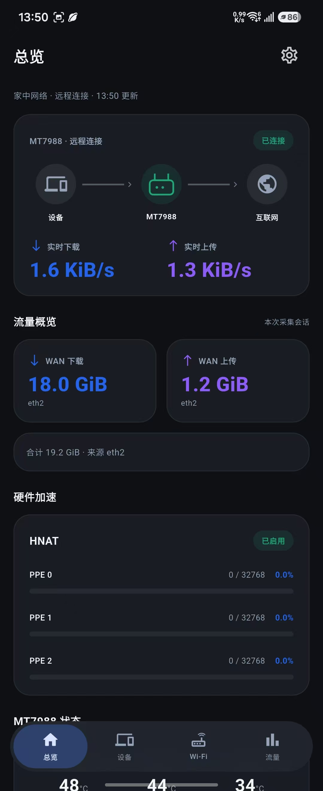
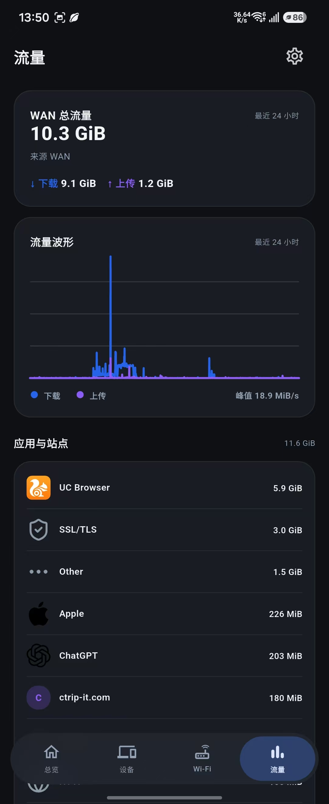

# ImmortalWrt 手机 App

面向 MT7988 路由器的独立 Android / iOS 状态查看工具。支持家庭局域网直连，也可通过可访问 `/ubus` 的 HTTPS 隧道在家外查看，不需要手机连接 VPN。

## 配套固件

主要配合 [MedyMa/BananaPi-BPI-R4](https://github.com/MedyMa/BananaPi-BPI-R4) 构建的 BPI-R4 / MT7988 ImmortalWrt 固件使用。BE14 无线历史和温度的已确认数据来自 MT7990 厂商驱动；其他驱动、机型和固件仅在提供相同接口时兼容，不能保证全部指标可用。

| 路由器软件包 | 用途 | 要求 |
| --- | --- | --- |
| `rpcd-mod-router-status` | CPU、温度、BE14 状态与无线历史 | 温度功能需要 0.1.2 或更新版本 |
| `luci-app-traffic` | 实时速率、流量记录、最近 24 小时曲线与应用图标 | 推荐 1.1.7 或更新版本 |
| `luci-app-sfp-status` | SFP 链路、速率与模块温度 | 提供 `luci.sfp-status.getStatuses` |
| turboacc | HNAT / PPE 已绑定流表与占用率 | 提供 `luci.turboacc.getMTKPPEStat` |

以上组件分工独立。Wi-Fi 和 CPU 不通过 Traffic App 读取；缺少某一组件时，相应区域显示不可用，其他数据仍可读取。

**固件选择、软件包格式、安装步骤及接口检查见 [配套固件与安装说明](#配套固件与安装详情)。** 小米 AX9000 是设备列表中的下游设备，不是手机 App 必须搭配的固件，也不接入 MiWiFi 管理接口。

## 页面功能

- **总览**：设备 → MT7988 → 互联网示意拓扑、实时下载/上传、会话 WAN 总量、HNAT / PPE、CPU、内存、温度与 SFP。
- **设备**：合并 DHCP 租约和流量记录，显示品牌或设备类型图标；点击查看名称、IP、MAC、流量及识别依据。`XiaoQiang` 按用户确认映射为小米 AX9000；其他设备不会套用该型号。三星 Z Flip / Z Fold 名称支持识别。
- **Wi-Fi**：BE14 频段、信道、EHT 带宽、BSSID，以及最近 24 小时的 TX FAL、RX CRC 和活动曲线。
- **流量**：最近 24 小时统计、速率曲线与完整应用/站点列表。总览的会话总量与 24 小时统计分开呈现。

设备记录不代表当前在线；拓扑图不等于上游互联网探测结果。PPE 百分比是硬件流表占用率，不是 CPU 使用率，也不是设备数量。无线驱动未提供可用的空中占用率和客户端信号分布时，不绘制这些指标。

## 页面截图

<table>
  <tr>
    <td align="center"><b>总览（未连接）</b><br></td>
    <td align="center"><b>总览</b><br></td>
    <td align="center"><b>设备</b><br></td>
    <td align="center"><b>Wi-Fi</b><br></td>
    <td align="center"><b>流量</b><br></td>
  </tr>
</table>

## 连接方式

1. 先安装或确认路由器组件，检查 [只读接口](#接口检查)。
2. 在 App 的连接页填写路由器地址和 LuCI / ubus 账号。HTTPS 地址可自行替换；代码中的默认地址为 `https://bananapi.x.ddnsto.com`。
3. 在家可使用 `http://192.168.2.1`。当前 App 和平台策略只允许这个 IP 使用明文 HTTP。
4. 在家外使用自己的 HTTPS 域名，并用手机蜂窝网络检查连接。隧道需要支持 App 直接访问 `/ubus`；浏览器登录 Cookie 不会自动带入 App。

手机 App 不保存 DDnsto 客户端令牌，不登录 DDnsto 账号。令牌在路由器 DDnsto 客户端中配置；隧道如果另加网页登录鉴权，需要另外解决 App 接入问题。

## 数据与安全

App 仅调用 `session.login` 和状态读取方法，不修改路由器配置、不建立 VPN、不在手机后台持续采集。推荐使用拥有必要读取权限的专用账号；App 只读并不会降低管理员账号本身的权限。

凭据通过 `flutter_secure_storage` 保存在 Android / iOS 系统安全存储中，退出连接会删除凭据；ubus 会话仅保存在内存。本地 HTTP 不加密；远程连接依赖 HTTPS 证书与第三方隧道可用性。

只轮询当前页面：总览实时速率每 1 秒读取，系统状态约每 15 秒更新，速率请求不重叠。App 切到后台后暂停轮询，返回前台立即刷新；会话失效后进行一次重新登录与重试，重复拒绝时停止自动尝试并提示检查权限。

无线采样在路由器侧独立运行，每分钟采样，保留最近 24 小时，按 5 分钟粒度传输。历史位于 `/tmp/router-status`；路由器重启会清空，普通服务重启或升级会保留。温度缓存超过 180 秒不再使用，缺失传感器显示 `—`。

## 界面

两端跟随系统日夜模式。iOS 的原生 UIKit 控件在支持的系统上使用 Liquid Glass，按钮及通用设备符号使用 SF Symbols；Android 使用 Flutter Material 3、系统动态色与玻璃导航。这不是原生 Compose 实现。

标题与设置按钮随页面滚动；系统时间、电量保持清晰，下方页面内容模糊显示。普通模式导航上滑隐藏、下滑即显示；Android 按原生触摸探索状态判断 TalkBack，开启时保持导航可访问，普通系统界面节点查询不会强制导航常显。胶囊恢复为原来的 60 dp 高度、40 dp 圆角和椭圆选中背景，大字体时随内容增高。保留滚动时的完整玻璃效果，高对比度或减少动态效果时使用不透明回退。

设备品牌图标随安装包保存，不依赖联网下载。Apple 地图和 Siri 使用随包提供的 128 像素 PNG，避免 Flutter 对源 SVG 样式和渐变的渲染差异，Android / iOS 共用。其他流量图标优先读取路由器图标库，其次使用 Traffic 后台获取的网站 favicon 缓存；缺失时显示域名前两个字母和固定日夜配色。手机不直接访问流量列表中的网站，不向网站发送路由器凭据。缓存索引约每分钟完整更新，超过 256 个网站也不会截断；PNG / ICO / 静态 SVG 网站图标进入可见区域后加载，单次读取最多 64 KiB、超时 3 秒，ICO 在手机侧转换为小尺寸 PNG。

自动网站缓存需要 `luci-app-traffic` 1.1.7-r2 或更新版本：路由器优先使用已挂载可写 NVMe，没有时使用 `/tmp`；不需要设置。单图最多 64 KiB、总缓存最多 16 MiB，成功 7 天更新、失败 24 小时重试；网页与手机共用缓存。旧版 Traffic 仍可读取包内图标，未提供缓存索引时正常显示字母回退。预览图中的示例数据不是路由器实测，Windows 下的 iOS 风格渲染也不等于原生模拟器截图。

`luci-app-traffic` 1.1.9-r1 增加网页内嵌 Base64 PNG / ICO 与经过严格检查的静态 SVG 图标。SVG 保留基本路径、形状、本地渐变与裁剪，统一显示尺寸 64；不接受脚本、外部引用、CSS、动画、递归引用和数值虚线，过大或过于复杂的图标也会被拒绝。采用两端已有的 SVG 渲染能力，不引入常驻转换服务；拒绝的图标继续使用字母回退，刷新失败保留原缓存。无法解析或连接的网站仍可能取不到图标。

网站缓存优先使用精确域名，未命中时在已识别的后缀边界内查最近父域；未知后缀只匹配精确域名。路由器最多保留 4096 条缓存记录，手机读取索引不截断。每秒实时速率只更新总览连接区域，硬件状态和静态导航不随每秒采样重建；实际帧率仍需真机验证。

## 构建与安装包

CI 使用 Flutter 3.47.5、Android 17 SDK（API 37）以及 Xcode 27 / iOS 27 SDK。Android 的 `targetSdk` 和最低版本遵循工程配置，不因编译 SDK 升级自动提高；iOS 保留 iOS 15 部署目标。

[GitHub Actions](https://github.com/MedyMa/immortalwrt-app/actions) 的常规构建提供：

- `immortalwrt-android-release`：固定签名的 Android release APK，可供后续覆盖升级。旧调试版首次迁移需先记录连接配置，卸载旧版后安装固定签名版本；后续可覆盖更新。
- `immortalwrt-ios-simulator`：未签名模拟器 App，不能安装到真实 iPhone，也不能上传 TestFlight。

真实 iPhone / TestFlight 需要有效的 Apple Developer Program、签名证书、描述文件和 App Store Connect 记录，详见 [TestFlight 发布说明](#testflight-发布详情)。

原生页面截图由 **Render native iOS pages** 单独构建，覆盖浅色、深色各四页。每页必须通过渲染就绪确认和图片有效性检查才发布截图；应用代码、iOS 工程、资源和依赖变化均会触发预览。

```sh
flutter pub get
dart format --output=none --set-exit-if-changed lib test
flutter analyze --fatal-infos
flutter test
flutter run
```

桌面图标源文件位于 `assets/app-icon-sources`，可使用 `tools/generate-app-icons.ps1` 重新生成。设计、草稿和计划统一保存在本地工作区 `Test/immortalwrt-app/`，不提交仓库。


## 配套固件与安装详情

### 适用对象

主要对象为 BPI-R4 / MT7988 路由器及 BE14（MT7990）无线模组，配合 [MedyMa/BananaPi-BPI-R4 固件构建项目](https://github.com/MedyMa/BananaPi-BPI-R4) 使用。

该 App 读取 MT7988 上的状态接口。小米 AX9000 可作为下游设备显示，不要求给 AX9000 刷入此固件，也不通过 MiWiFi 读取 BE14。

### 固件构建路线

| 构建工作流 | 固件源码及分支 | 与手机 App 的关系 |
| --- | --- | --- |
| `MT7988-Action.yml` | `MedyMa/immortalwrt-mt798x-6.6`，`mt798x-mt799x-6.6-mtwifi` | MT7988 厂商无线驱动路线；BE14 私有统计以此类驱动的数据为依据 |
| `immortalwrt_25.12_wifi7.yml` | `amhelibrary/immortalwrt`，`openwrt-25.12-mtk-hqos` | Wi-Fi7 / mt76 路线；不能直接假设具有厂商 `iwpriv stat` 字段 |
| `immortalwrt-25.12.yml` | `immortalwrt/immortalwrt`，`openwrt-25.12` | 通过独立组件提供状态接口；射频和传感器指标依驱动支持而定 |

构建路线依据 [厂商路线工作流](https://github.com/MedyMa/BananaPi-BPI-R4/blob/main/.github/workflows/MT7988-Action.yml) 和 [Wi-Fi7 工作流](https://github.com/MedyMa/BananaPi-BPI-R4/blob/main/.github/workflows/immortalwrt_25.12_wifi7.yml)。本地构建配置已加入独立状态组件的合入与选中检查；旧版固件、下载到的具体镜像和硬件运行情况仍须通过下面的命令确认。配置选中不等于所有硬件指标已经实测。

手机 App 不依赖某个固定固件发布日期。决定功能是否可用的是软件包版本、只读 RPC、账号权限和传感器/驱动能力。

### 需要哪些软件包

| 软件包 / 服务 | 最低约束或接口 | 数据 |
| --- | --- | --- |
| `rpcd-mod-router-status` | 温度需要 0.1.2 或更新版本 | CPU 计数器、CPU/无线/硬盘温度、BE14 状态及历史 |
| `luci-app-traffic` | 推荐 1.1.7 或更新版本 | 下载/上传速率、会话总量、24 小时统计、应用/站点记录及图标 |
| `luci-app-sfp-status` | `getStatuses` | SFP 插槽、链路、协商速率、模块温度 |
| turboacc | `getMTKPPEStat` | PPE 已绑定流表和容量 |
| 固件自带 rpcd / LuCI 读取接口 | `system.info`、`luci-rpc.getDHCPLeases` | 运行时间、内存、DHCP 租约 |

状态组件与 Traffic 完全独立。安装旧版状态组件可能有 CPU 数据却没有温度字段。安装 Traffic 不能替代安装状态组件。

### 安装

从 [路由器组件构建页](https://github.com/MedyMa/luci-app/actions) 下载与固件版本、架构和包管理器匹配的软件包。组件源码与检查说明见 [rpcd-mod-router-status](https://github.com/MedyMa/luci-app/tree/main/Luci-app/rpcd-mod-router-status)。

先确认设备信息和包管理器：

```sh
ubus call system board '{}'
command -v opkg
command -v apk
```

使用 `opkg` 的固件安装 `.ipk`；使用 `apk` 的固件安装路由器 `.apk`。常见 24.10 固件使用 `opkg`，25.12 路线常见 `apk`，但定制固件以实际命令输出为准。**路由器 `.apk` 不是 Android 手机安装包。** 不要只按文件后缀或固件名称猜测兼容性。

以已下载到 `/tmp` 的状态组件为例，选择与设备一致的一条命令执行：

```sh
opkg install /tmp/rpcd-mod-router-status_实际版本_实际架构.ipk
# 或在 apk 固件上：
apk add /tmp/rpcd-mod-router-status-实际版本.apk
```

示例文件名需替换为实际下载文件名，不要强制忽略架构、依赖或签名校验。安装会注册 `router.status` 并启动采样服务，rpcd 重启后旧会话可能失效，请重新连接 App / LuCI。

专用只读账号需包含 `router-status` 读取 ACL，并按使用功能授予 Traffic、SFP、turboacc 与 DHCP 的读取权限；不需要授予写权限。

### 接口检查

```sh
ubus -v list router.status
ubus call router.status getSystemMetrics '{}'
ubus call router.status getWirelessStatus '{}'
ubus call router.status getWirelessHistory '{}'
/etc/init.d/router-status status
ubus -v list luci.traffic
ubus call luci.sfp-status getStatuses '{}'
ubus call luci.turboacc getMTKPPEStat '{}'
```

- `Not found`：对象未注册，检查包是否安装及 rpcd 注册状态。
- `Method not found`：对象存在但该方法缺失，检查组件版本与接口。
- `Access denied`：检查手机账号读取 ACL；root 在 SSH 中读取成功不证明手机账号有权限。
- 无线历史为空：首次运行至少等待两次采样；不要用示意曲线填充。
- CPU 使用率需要两次计数器采样；温度缺失可能是组件版本、采样缓存或传感器不支持。

厂商 BE14 已确认能提供 TX 成功/失败、RX 成功/CRC 与温度字段，但未取得可用的空中占用率或客户端信号分布。TX FAL 与 RX CRC 是不同的质量指标，不作为重试率或干扰率显示。

历史保存在 `/tmp/router-status`，每分钟采样，按 5 分钟桶保留最近 24 小时。路由器重启清空；普通服务重启和升级保留。缺失与计数器重置保留为空值，不编造为零。

### 家外访问

App 通过普通 HTTPS 请求访问路由器 `/ubus`，认证使用路由器账号。路由器负责配置 DDnsto 客户端令牌和隧道映射；手机端不含该令牌。

需要确认自己的域名能直接返回 ubus JSON，而不是隧道网页登录页面。安装后在手机蜂窝网络下验证登录及授权读取；局域网测试不能证明家外链路可用。


## TestFlight 发布详情

手动工作流 **Publish iOS to TestFlight** 构建已签名真机 IPA 并上传 App Store Connect。普通 CI 的模拟器 App 不能用于 TestFlight。

### 前置条件

Apple Developer Program 已生效，并能创建分发证书和描述文件。在同一团队创建 App Store Connect 应用记录和明确 App ID：`com.medyma.immortalwrtApp`。导出包含私钥、受密码保护的 Apple Distribution P12，并创建匹配 App ID 和证书的 App Store 分发描述文件。

### GitHub 机密变量

在仓库或 `testflight` 环境中配置：

| 变量 | 内容 |
| --- | --- |
| `IOS_TEAM_ID` | Apple 开发者团队 ID |
| `IOS_DISTRIBUTION_P12_BASE64` | 分发证书 P12 的 Base64 |
| `IOS_DISTRIBUTION_P12_PASSWORD` | P12 导出密码 |
| `IOS_PROVISION_PROFILE_BASE64` | 分发描述文件的 Base64 |
| `ASC_KEY_ID` | App Store Connect 团队 API 密钥 ID |
| `ASC_ISSUER_ID` | API 密钥签发者 ID |
| `ASC_PRIVATE_KEY_BASE64` | API 密钥 P8 的 Base64 |

API 密钥需要足够的应用访问权限。工作流不需要 Apple ID 登录密码，不要将证书、私钥、密码或验证码提交仓库。

### 发布步骤

1. 在 `main` 手动运行工作流，输入未使用过的构建号；每次上传递增，不固定沿用工作流默认值。
2. 检查签名、真机构建和上传步骤是否成功。
3. 在 App Store Connect → TestFlight 等待处理，按要求填写出口合规信息，再分配测试组。
4. 外部测试可能需要 Apple 测试版审核；工作流不会自动邀请测试者。

上传成功仅表示 Apple 接收了构建，不表示已经可供测试。Windows 可检查配置，不能替代 macOS / Xcode 的签名上传验证。开发者资格或签名配置未完成时，继续使用常规 Android / iOS 模拟器构建。

### 签名机密范围

依赖安装、分析、测试和 Flutter/CocoaPods 构建均不注入签名或上传密钥。先生成无签名归档，再在独立步骤导入分发证书和描述文件，通过 `xcodebuild -exportArchive` 签名导出；导出阶段不再执行项目构建脚本。App Store Connect API 密钥只在上传步骤提供。

已签名 IPA 不发布为 GitHub Actions artifact，只上传 App Store Connect。无论发布成功还是失败，最后一步清理临时钥匙串、描述文件、上传密钥和 IPA。P12 密码显式掩码；GitHub 机密变量自身也有日志掩码。
