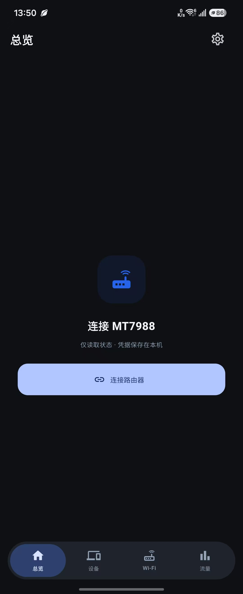
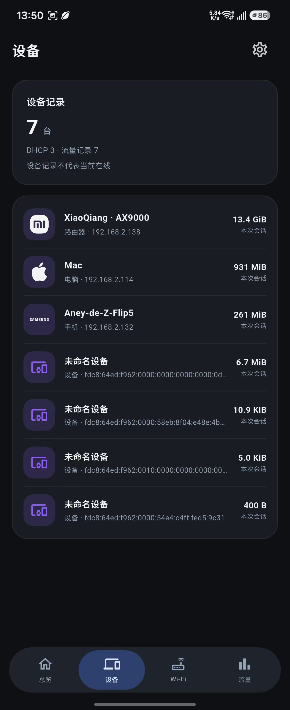
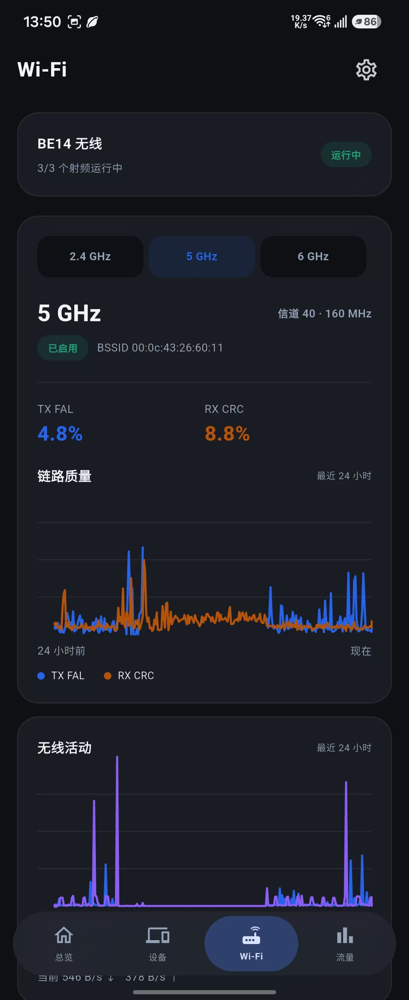

# ImmortalWrt 手机 App

面向 MT7988 路由器的独立 Android / iOS 状态查看工具。支持家庭局域网直连，也可通过可访问 `/ubus` 的 HTTPS 隧道在家外查看，不需要手机连接 VPN。

## 配套固件

主要配合 [MedyMa/BananaPi-BPI-R4](https://github.com/MedyMa/BananaPi-BPI-R4) 构建的 BPI-R4 / MT7988 ImmortalWrt 固件使用。BE14 无线历史和温度的已确认数据来自 MT7990 厂商驱动；其他驱动、机型和固件仅在提供相同接口时兼容，不能保证全部指标可用。

| 路由器软件包 | 用途 | 要求 |
| --- | --- | --- |
| `rpcd-mod-router-status` | CPU、温度、BE14 状态与无线历史 | 温度功能需要 0.1.2 或更新版本 |
| `luci-app-traffic` | 实时速率、流量记录、最近 24 小时曲线与应用图标 | 推荐 1.1.7 或更新版本 |
| `luci-app-sfp-status` | SFP 链路、速率与模块温度 | 提供 `luci.sfp-status.getStatuses` |
| turboacc | HNAT / PPE 已绑定流表与占用率 | 提供 `luci.turboacc.getMTKPPEStat` |

以上组件分工独立。Wi-Fi 和 CPU 不通过 Traffic App 读取；缺少某一组件时，相应区域显示不可用，其他数据仍可读取。

**固件选择、软件包格式、安装步骤及接口检查见 [配套固件与安装说明](docs/firmware.md)。** 小米 AX9000 是设备列表中的下游设备，不是手机 App 必须搭配的固件，也不接入 MiWiFi 管理接口。

## 页面功能

- **总览**：设备 → MT7988 → 互联网示意拓扑、实时下载/上传、会话 WAN 总量、HNAT / PPE、CPU、内存、温度与 SFP。
- **设备**：合并 DHCP 租约和流量记录，显示品牌或设备类型图标；点击查看名称、IP、MAC、流量及识别依据。`XiaoQiang` 按用户确认映射为小米 AX9000；其他设备不会套用该型号。三星 Z Flip / Z Fold 名称支持识别。
- **Wi-Fi**：BE14 频段、信道、EHT 带宽、BSSID，以及最近 24 小时的 TX FAL、RX CRC 和活动曲线。
- **流量**：最近 24 小时统计、速率曲线与完整应用/站点列表。总览的会话总量与 24 小时统计分开呈现。

设备记录不代表当前在线；拓扑图不等于上游互联网探测结果。PPE 百分比是硬件流表占用率，不是 CPU 使用率，也不是设备数量。无线驱动未提供可用的空中占用率和客户端信号分布时，不绘制这些指标。

## 页面截图

<table>
  <tr>
    <td align="center"><b>总览（未连接）</b><br></td>
    <td align="center"><b>总览</b><br></td>
    <td align="center"><b>设备</b><br></td>
    <td align="center"><b>Wi-Fi</b><br></td>
    <td align="center"><b>流量</b><br></td>
  </tr>
</table>

## 连接方式

1. 先安装或确认路由器组件，检查 [只读接口](docs/firmware.md#接口检查)。
2. 在 App 的连接页填写路由器地址和 LuCI / ubus 账号。HTTPS 地址可自行替换；代码中的默认地址为 `https://bananapi.x.ddnsto.com`。
3. 在家可使用 `http://192.168.2.1`。当前 App 和平台策略只允许这个 IP 使用明文 HTTP。
4. 在家外使用自己的 HTTPS 域名，并用手机蜂窝网络检查连接。隧道需要支持 App 直接访问 `/ubus`；浏览器登录 Cookie 不会自动带入 App。

手机 App 不保存 DDnsto 客户端令牌，不登录 DDnsto 账号。令牌在路由器 DDnsto 客户端中配置；隧道如果另加网页登录鉴权，需要另外解决 App 接入问题。

## 数据与安全

App 仅调用 `session.login` 和状态读取方法，不修改路由器配置、不建立 VPN、不在手机后台持续采集。推荐使用拥有必要读取权限的专用账号；App 只读并不会降低管理员账号本身的权限。

凭据通过 `flutter_secure_storage` 保存在 Android / iOS 系统安全存储中，退出连接会删除凭据；ubus 会话仅保存在内存。本地 HTTP 不加密；远程连接依赖 HTTPS 证书与第三方隧道可用性。

只轮询当前页面：总览实时速率每 1 秒读取，系统状态约每 15 秒更新，速率请求不重叠。App 切到后台后暂停轮询，返回前台立即刷新；会话失效后进行一次重新登录与重试，重复拒绝时停止自动尝试并提示检查权限。

无线采样在路由器侧独立运行，每分钟采样，保留最近 24 小时，按 5 分钟粒度传输。历史位于 `/tmp/router-status`；路由器重启会清空，普通服务重启或升级会保留。温度缓存超过 180 秒不再使用，缺失传感器显示 `—`。

## 界面

两端跟随系统日夜模式。iOS 的原生 UIKit 控件在支持的系统上使用 Liquid Glass，按钮及通用设备符号使用 SF Symbols；Android 使用 Flutter Material 3、系统动态色与玻璃导航。这不是原生 Compose 实现。

标题与设置按钮随页面滚动；系统时间、电量保持清晰，下方页面内容模糊显示。导航上滑隐藏，回到顶部时显示；保留滚动时的完整玻璃效果，高对比度或减少动态效果时使用不透明回退。

设备品牌图标随安装包保存，不依赖联网下载。流量图标优先读取路由器图标库，其次使用 Traffic 后台获取的网站 favicon 缓存；缺失时显示域名前两个字母和固定日夜配色。手机不直接访问流量列表中的网站，不向网站发送路由器凭据。缓存索引约每分钟更新，PNG / ICO 图标进入可见区域后加载，ICO 在手机侧转换为小尺寸 PNG。

自动网站缓存需要 `luci-app-traffic` 1.1.7-r2 或更新版本：路由器优先使用已挂载可写 NVMe，没有时使用 `/tmp`；不需要设置。单图最多 64 KiB、总缓存最多 16 MiB，成功 7 天更新、失败 24 小时重试；网页与手机共用缓存。旧版 Traffic 仍可读取包内图标，未提供缓存索引时正常显示字母回退。预览图中的示例数据不是路由器实测，Windows 下的 iOS 风格渲染也不等于原生模拟器截图。

## 构建与安装包

CI 使用 Flutter 3.47.5、Android 17 SDK（API 37）以及 Xcode 27 / iOS 27 SDK。Android 的 `targetSdk` 和最低版本遵循工程配置，不因编译 SDK 升级自动提高；iOS 保留 iOS 15 部署目标。

[GitHub Actions](https://github.com/MedyMa/immortalwrt-app/actions) 的常规构建提供：

- `immortalwrt-android-debug`：可安装的 Android 调试 APK。
- `immortalwrt-ios-simulator`：未签名模拟器 App，不能安装到真实 iPhone，也不能上传 TestFlight。

真实 iPhone / TestFlight 需要有效的 Apple Developer Program、签名证书、描述文件和 App Store Connect 记录，详见 [TestFlight 发布说明](docs/testflight.md)。

```sh
flutter pub get
dart format --output=none --set-exit-if-changed lib test
flutter analyze --fatal-infos
flutter test
flutter run
```

桌面图标源文件位于 `design/app-icons`，可使用 `tools/generate-app-icons.ps1` 重新生成。设备识别与详情设计见 [设备图标说明](design/device-icons.md)。`design/`、`docs/` 中较早的设计与计划保留演进记录；当前使用方式以本文和配套固件说明为准。
